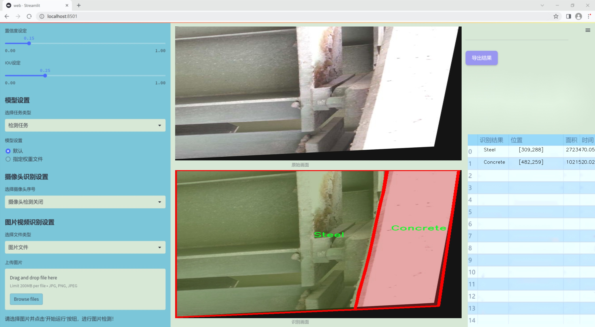

### 1.背景意义

研究背景与意义

随着城市化进程的加快，桥梁作为重要的交通基础设施，其安全性和耐久性日益受到关注。桥梁的表面材料，如混凝土和钢材，直接影响其结构的稳定性和使用寿命。因此，针对桥梁表面材料的有效检测与分割，成为了确保桥梁安全和维护的重要任务。传统的人工检测方法不仅耗时耗力，而且容易受到人为因素的影响，导致检测结果的不准确性。因此，亟需一种高效、准确的自动化检测系统，以提高桥梁维护的效率和可靠性。

近年来，深度学习技术在计算机视觉领域取得了显著进展，尤其是目标检测和图像分割任务中。YOLO（You Only Look Once）系列模型因其快速和高效的特性，成为了目标检测领域的热门选择。YOLOv11作为该系列的最新版本，结合了多种先进的技术和算法，能够在保持高精度的同时，实现实时检测。然而，针对特定应用场景，如桥梁表面材料的分割检测，仍需对YOLOv11进行改进和优化，以适应不同材料的特征和环境条件。

本研究旨在基于改进的YOLOv11模型，构建一个桥梁表面建造材料的分割检测系统。所使用的数据集包含4028张经过精细标注的图像，涵盖混凝土和钢材两种主要材料。通过对数据集的预处理和增强，提升模型的泛化能力和鲁棒性，使其能够在实际应用中有效识别和分割不同材料。这一系统的成功实现，不仅能够为桥梁的定期检查和维护提供技术支持，还能为相关领域的研究提供重要的数据基础和理论指导，推动智能检测技术在基础设施安全管理中的应用。

### 2.视频效果

[2.1 视频效果](https://www.bilibili.com/video/BV1BeSKYmE1n/)

### 3.图片效果




##### [项目涉及的源码数据来源链接](https://kdocs.cn/l/cszuIiCKVNis)**

注意：本项目提供训练的数据集和训练教程,由于版本持续更新,暂不提供权重文件（best.pt）,请按照6.训练教程进行训练后实现上图演示的效果。

### 4.数据集信息

##### 4.1 本项目数据集类别数＆类别名

nc: 2
names: ['Concrete', 'Steel']


该项目为【图像分割】数据集，请在【训练教程和Web端加载模型教程（第三步）】这一步的时候按照【图像分割】部分的教程来训练

##### 4.2 本项目数据集信息介绍

本项目数据集信息介绍

本项目所使用的数据集专注于桥梁表面建造材料的分割检测，旨在改进YOLOv11模型在材料识别和分割任务中的表现。数据集包含两种主要的材料类别：混凝土（Concrete）和钢材（Steel），这两种材料是现代桥梁建设中最常见的构成部分。通过对这两种材料的精确分割与检测，系统能够有效识别桥梁表面的不同构造，进而为桥梁的维护与管理提供重要的支持。

在数据集的构建过程中，采用了多种数据采集技术，包括高分辨率图像拍摄和激光扫描，以确保所收集的样本具有足够的多样性和代表性。数据集中包含的图像涵盖了不同的光照条件、角度和背景，旨在提高模型的鲁棒性和适应性。此外，为了确保数据的准确性和有效性，所有图像均经过专业人员的标注，确保每个像素的分类都与实际材料相符。

该数据集的设计不仅关注于数量的积累，更强调质量的提升。每个类别的样本数量经过精心选择，以保证在训练过程中模型能够充分学习到混凝土和钢材的特征差异。通过对数据集的深入分析和处理，期望在训练改进后的YOLOv11模型时，能够实现更高的分割精度和更快的检测速度。

综上所述，本项目的数据集为桥梁表面建造材料的分割检测提供了坚实的基础，助力于实现更智能化的桥梁监测与维护系统。通过有效的材料分割，能够为桥梁的安全评估和长期管理提供重要的数据支持，进而推动智能交通基础设施的发展。


### 5.全套项目环境部署视频教程（零基础手把手教学）

[5.1 所需软件PyCharm和Anaconda安装教程（第一步）](https://www.bilibili.com/video/BV1BoC1YCEKi/?spm_id_from=333.999.0.0&vd_source=bc9aec86d164b67a7004b996143742dc)


[5.2 安装Python虚拟环境创建和依赖库安装视频教程（第二步）](https://www.bilibili.com/video/BV1ZoC1YCEBw?spm_id_from=333.788.videopod.sections&vd_source=bc9aec86d164b67a7004b996143742dc)

### 6.改进YOLOv11训练教程和Web_UI前端加载模型教程（零基础手把手教学）

[6.1 改进YOLOv11训练教程和Web_UI前端加载模型教程（第三步）](https://www.bilibili.com/video/BV1BoC1YCEhR?spm_id_from=333.788.videopod.sections&vd_source=bc9aec86d164b67a7004b996143742dc)


按照上面的训练视频教程链接加载项目提供的数据集，运行train.py即可开始训练



     Epoch   gpu_mem       box       obj       cls    labels  img_size
     1/200     20.8G   0.01576   0.01955  0.007536        22      1280: 100%|██████████| 849/849 [14:42<00:00,  1.04s/it]
               Class     Images     Labels          P          R     mAP@.5 mAP@.5:.95: 100%|██████████| 213/213 [01:14<00:00,  2.87it/s]
                 all       3395      17314      0.994      0.957      0.0957      0.0843

     Epoch   gpu_mem       box       obj       cls    labels  img_size
     2/200     20.8G   0.01578   0.01923  0.007006        22      1280: 100%|██████████| 849/849 [14:44<00:00,  1.04s/it]
               Class     Images     Labels          P          R     mAP@.5 mAP@.5:.95: 100%|██████████| 213/213 [01:12<00:00,  2.95it/s]
                 all       3395      17314      0.996      0.956      0.0957      0.0845

     Epoch   gpu_mem       box       obj       cls    labels  img_size
     3/200     20.8G   0.01561    0.0191  0.006895        27      1280: 100%|██████████| 849/849 [10:56<00:00,  1.29it/s]
               Class     Images     Labels          P          R     mAP@.5 mAP@.5:.95: 100%|███████   | 187/213 [00:52<00:00,  4.04it/s]
                 all       3395      17314      0.996      0.957      0.0957      0.0845


###### [项目数据集下载链接](https://kdocs.cn/l/cszuIiCKVNis)

### 7.原始YOLOv11算法讲解


###### YOLOv11改进方向

与YOLOv 10相比，YOLOv 11有了巨大的改进，包括但不限于：

  * 增强的模型结构：模型具有改进的模型结构，以获取图像处理并形成预测
  * GPU优化：这是现代ML模型的反映，GPU训练ML模型在速度和准确性上都更好。
  * 速度：YOLOv 11模型现在经过增强和GPU优化以用于训练。通过优化，这些模型比它们的前版本快得多。在速度上达到了25%的延迟减少！
  * 更少的参数：更少的参数允许更快的模型，但v11的准确性不受影响
  * 更具适应性：更多支持的任务YOLOv 11支持多种类型的任务、多种类型的对象和多种类型的图像。

###### YOLOv11功能介绍

Glenn Jocher和他的团队制作了一个令人敬畏的YOLOv 11迭代，并且在图像人工智能的各个方面都提供了YOLO。YOLOv 11有多种型号，包括：

  * 对象检测-在训练时检测图像中的对象
  * 图像分割-超越对象检测，分割出图像中的对象
  * 姿态检测-当用点和线训练时绘制一个人的姿势
  * 定向检测（OBB）：类似于对象检测，但包围盒可以旋转
  * 图像分类-在训练时对图像进行分类

使用Ultralytics Library，这些模型还可以进行优化，以：

  * 跟踪-可以跟踪对象的路径
  * 易于导出-库可以以不同的格式和目的导出
  * 多场景-您可以针对不同的对象和图像训练模型

此外，Ultralytics还推出了YOLOv 11的企业模型，该模型将于10月31日发布。这将与开源的YOLOv
11模型并行，但将拥有更大的专有Ultralytics数据集。YOLOv 11是“建立在过去的成功”的其他版本的之上。

###### YOLOv11模型介绍

YOLOv 11附带了边界框模型（无后缀），实例分割（-seg），姿态估计（-pose），定向边界框（-obb）和分类（-cls）。

这些也有不同的尺寸：纳米（n），小（s），中（m），大（l），超大（x）。


YOLOv11模型

###### YOLOv11与前版本对比

与YOLOv10和YOLOv8相比，YOLOv11在Ultralytics的任何帖子中都没有直接提到。所以我会收集所有的数据来比较它们。感谢Ultralytics：

**检测：**


YOLOv11检测统计


YOLOv10检测统计

其中，Nano的mAPval在v11上为39.5，v10上为38.5；Small为47.0 vs 46.3，Medium为51.5 vs
51.1，Large为53.4 vs 53.2，Extra Large为54.7vs
54.4。现在，这可能看起来像是一种增量增加，但小小数的增加可能会对ML模型产生很大影响。总体而言，YOLOv11以0.3
mAPval的优势追平或击败YOLOv10。

现在，我们必须看看速度。在延迟方面，Nano在v11上为1.55 , v10上为1.84，Small为2.46 v2.49，Medium为4.70
v4.74，Large为6.16 v7.28，Extra Large为11.31
v10.70。延迟越低越好。YOLOv11提供了一个非常低的延迟相比，除了特大做得相当差的前身。

总的来说，Nano模型是令人振奋的，速度更快，性能相当。Extra Large在性能上有很好的提升，但它的延迟非常糟糕。

**分割：**


YOLOV11 分割统计


YOLOV9 分割统计


YOLOV8 分割数据

总体而言，YOLOv 11上的分割模型在大型和超大型模型方面比上一代YOLOv 8和YOLOv 9做得更好。

YOLOv 9 Segmentation没有提供任何关于延迟的统计数据。比较YOLOv 11延迟和YOLOv 8延迟，发现YOLOv 11比YOLOv
8快得多。YOLOv 11将大量GPU集成到他们的模型中，因此期望他们的模型甚至比CPU测试的基准更快！

姿态估计：


YOLOV11姿态估计统计


YOLOV8姿态估计统计

YOLOv 11的mAP 50 -95统计量也逐渐优于先前的YOLOv 8（除大型外）。然而，在速度方面，YOLOv
11姿势可以最大限度地减少延迟。其中一些延迟指标是版本的1/4！通过对这些模型进行GPU训练优化，我可以看到指标比显示的要好得多。

**定向边界框：**


YOLOv11 OBB统计


YOLOv8 OBB统计

OBB统计数据在mAP
50上并不是很好，只有非常小的改进，在某种程度上小于检测中的微小改进。然而，从v8到v11的速度减半，这表明YOLOv11在速度上做了很多努力。

**最后，分类：**


YOLOv 11 CLS统计


YOLOv8 CLS统计

从v8到v11，准确性也有了微小的提高。然而，速度大幅上升，CPU速度更快的型号。


### 8.200+种全套改进YOLOV11创新点原理讲解

#### 8.1 200+种全套改进YOLOV11创新点原理讲解大全

由于篇幅限制，每个创新点的具体原理讲解就不全部展开，具体见下列网址中的改进模块对应项目的技术原理博客网址【Blog】（创新点均为模块化搭建，原理适配YOLOv5~YOLOv11等各种版本）

[改进模块技术原理博客【Blog】网址链接](https://gitee.com/qunmasj/good)


#### 8.2 精选部分改进YOLOV11创新点原理讲解

###### 这里节选部分改进创新点展开原理讲解(完整的改进原理见上图和[改进模块技术原理博客链接](https://gitee.com/qunmasj/good)【如果此小节的图加载失败可以通过CSDN或者Github搜索该博客的标题访问原始博客，原始博客图片显示正常】
### CBAM空间注意力机制
近年来，随着深度学习研究方向的火热，注意力机制也被广泛地应用在图像识别、语音识别和自然语言处理等领域，注意力机制在深度学习任务中发挥着举足轻重的作用。注意力机制借鉴于人类的视觉系统，例如，人眼在看到一幅画面时，会倾向于关注画面中的重要信息，而忽略其他可见的信息。深度学习中的注意力机制和人类视觉的注意力机制相似，通过扫描全局数据，从大量数据中选择出需要重点关注的、对当前任务更为重要的信息，然后对这部分信息分配更多的注意力资源，从这些信息中获取更多所需要的细节信息，而抑制其他无用的信息。而在深度学习中，则具体表现为给感兴趣的区域更高的权重，经过网络的学习和调整，得到最优的权重分配，形成网络模型的注意力，使网络拥有更强的学习能力，加快网络的收敛速度。
注意力机制通常可分为软注意力机制和硬注意力机制[4-5]。软注意力机制在选择信息时，不是从输入的信息中只选择1个，而会用到所有输入信息，只是各个信息对应的权重分配不同，然后输入网络模型进行计算;硬注意力机制则是从输入的信息中随机选取一个或者选择概率最高的信息，但是这一步骤通常是不可微的，导致硬注意力机制更难训练。因此，软注意力机制应用更为广泛，按照原理可将软注意力机制划分为:通道注意力机制（channel attention)、空间注意力机制(spatial attention）和混合域注意力机制(mixed attention)。
通道注意力机制的本质建立各个特征通道之间的重要程度，对感兴趣的通道进行重点关注，弱化不感兴趣的通道的作用;空间注意力的本质则是建模了整个空间信息的重要程度，然后对空间内感兴趣的区域进行重点关注，弱化其余非感兴趣区域的作用;混合注意力同时运用了通道注意力和空间注意力，两部分先后进行或并行，形成对通道特征和空间特征同时关注的注意力模型。

卷积层注意力模块(Convolutional Block Attention Module，CBAM）是比较常用的混合注意力模块，其先后集中了通道注意力模块和空间注意力模块，网络中加入该模块能有效提高网络性能，减少网络模型的计算量，模块结构如图所示。输入特征图首先经过分支的通道注意力模块，然后和主干的原特征图融合，得到具有通道注意力的特征图，接着经过分支的空间注意力模块，在和主干的特征图融合后，得到同时具有通道特征注意力和空间特征注意力的特征图。CBAM模块不改变输入特征图的大小，因此该模块是一个“即插即用”的模块，可以插入网络的任何位置。

通道注意力模块的结构示意图如图所示，通道注意力模块分支并行地对输入的特征图进行最大池化操作和平均池化操作，然后利用多层感知机对结果进行变换，得到应用于两个通道的变换结果，最后经过sigmoid激活函数将变换结果融合，得到具有通道注意力的通道特征图。

空间注意力模块示意图如图所示，将通道注意力模块输出的特征图作为该模块的输入特征图，首先对输入特征图进行基于通道的最大池化操作和平均池化操作，将两部分得到的结果拼接起来，然后通过卷积得到降为Ⅰ通道的特征图，最后通过sigmoid激活函数生成具有空间注意力的特征图。


### 9.系统功能展示

图9.1.系统支持检测结果表格显示

  图9.2.系统支持置信度和IOU阈值手动调节

  图9.3.系统支持自定义加载权重文件best.pt(需要你通过步骤5中训练获得)

  图9.4.系统支持摄像头实时识别

  图9.5.系统支持图片识别

  图9.6.系统支持视频识别

  图9.7.系统支持识别结果文件自动保存

  图9.8.系统支持Excel导出检测结果数据


### 10. YOLOv11核心改进源码讲解

#### 10.1 dynamic_snake_conv.py

以下是对给定代码的核心部分进行提炼和详细注释的结果。代码主要实现了动态蛇形卷积（Dynamic Snake Convolution），其核心在于 `DySnakeConv` 和 `DSConv` 类。以下是精简后的代码和注释：

```python
import torch
import torch.nn as nn

class DySnakeConv(nn.Module):
    def __init__(self, inc, ouc, k=3) -> None:
        """
        DySnakeConv构造函数
        :param inc: 输入通道数
        :param ouc: 输出通道数
        :param k: 卷积核大小
        """
        super().__init__()
        
        # 定义三个卷积层
        self.conv_0 = Conv(inc, ouc, k)  # 标准卷积
        self.conv_x = DSConv(inc, ouc, 0, k)  # 沿x轴的动态蛇形卷积
        self.conv_y = DSConv(inc, ouc, 1, k)  # 沿y轴的动态蛇形卷积
    
    def forward(self, x):
        """
        前向传播函数
        :param x: 输入特征图
        :return: 拼接后的输出特征图
        """
        # 将三个卷积的输出在通道维度上拼接
        return torch.cat([self.conv_0(x), self.conv_x(x), self.conv_y(x)], dim=1)

class DSConv(nn.Module):
    def __init__(self, in_ch, out_ch, morph, kernel_size=3, if_offset=True, extend_scope=1):
        """
        动态蛇形卷积构造函数
        :param in_ch: 输入通道数
        :param out_ch: 输出通道数
        :param morph: 卷积核的形态（0: x轴, 1: y轴）
        :param kernel_size: 卷积核大小
        :param if_offset: 是否使用偏移
        :param extend_scope: 偏移范围
        """
        super(DSConv, self).__init__()
        # 用于学习可变形偏移的卷积层
        self.offset_conv = nn.Conv2d(in_ch, 2 * kernel_size, 3, padding=1)
        self.bn = nn.BatchNorm2d(2 * kernel_size)  # 批归一化
        self.kernel_size = kernel_size

        # 定义沿x轴和y轴的动态蛇形卷积
        self.dsc_conv_x = nn.Conv2d(in_ch, out_ch, kernel_size=(kernel_size, 1), stride=(kernel_size, 1), padding=0)
        self.dsc_conv_y = nn.Conv2d(in_ch, out_ch, kernel_size=(1, kernel_size), stride=(1, kernel_size), padding=0)

        self.gn = nn.GroupNorm(out_ch // 4, out_ch)  # 组归一化
        self.act = Conv.default_act  # 默认激活函数

        self.extend_scope = extend_scope
        self.morph = morph
        self.if_offset = if_offset

    def forward(self, f):
        """
        前向传播函数
        :param f: 输入特征图
        :return: 卷积后的特征图
        """
        # 计算偏移
        offset = self.offset_conv(f)
        offset = self.bn(offset)
        offset = torch.tanh(offset)  # 将偏移限制在[-1, 1]之间

        # 创建动态蛇形卷积实例
        dsc = DSC(f.shape, self.kernel_size, self.extend_scope, self.morph)
        deformed_feature = dsc.deform_conv(f, offset, self.if_offset)  # 进行可变形卷积

        # 根据morph选择相应的卷积
        if self.morph == 0:
            x = self.dsc_conv_x(deformed_feature.type(f.dtype))
        else:
            x = self.dsc_conv_y(deformed_feature.type(f.dtype))

        x = self.gn(x)  # 归一化
        x = self.act(x)  # 激活
        return x

class DSC(object):
    def __init__(self, input_shape, kernel_size, extend_scope, morph):
        """
        动态蛇形卷积坐标计算
        :param input_shape: 输入特征图的形状
        :param kernel_size: 卷积核大小
        :param extend_scope: 偏移范围
        :param morph: 卷积核的形态
        """
        self.num_points = kernel_size
        self.width = input_shape[2]
        self.height = input_shape[3]
        self.morph = morph
        self.extend_scope = extend_scope  # 偏移范围

        # 定义特征图的形状
        self.num_batch = input_shape[0]
        self.num_channels = input_shape[1]

    def deform_conv(self, input, offset, if_offset):
        """
        执行可变形卷积
        :param input: 输入特征图
        :param offset: 偏移
        :param if_offset: 是否使用偏移
        :return: 变形后的特征图
        """
        y, x = self._coordinate_map_3D(offset, if_offset)  # 计算坐标图
        deformed_feature = self._bilinear_interpolate_3D(input, y, x)  # 双线性插值
        return deformed_feature

    # 省略其他辅助函数，主要集中在核心逻辑
```

### 注释说明：
1. **DySnakeConv**: 这个类是动态蛇形卷积的主要实现，包含了三个卷积层：一个标准卷积和两个动态蛇形卷积（分别沿x轴和y轴）。
2. **DSConv**: 这个类实现了动态蛇形卷积的核心逻辑，包括偏移的计算和特征图的变形。
3. **DSC**: 这个类用于计算坐标图和执行可变形卷积的操作，包含了对输入特征图的处理和偏移的应用。

通过以上注释，可以更清晰地理解代码的结构和功能。

这个文件 `dynamic_snake_conv.py` 实现了一个动态蛇形卷积（Dynamic Snake Convolution）模块，主要用于深度学习中的卷积操作。该模块由两个主要类组成：`DySnakeConv` 和 `DSConv`，以及一个辅助类 `DSC`。

在 `DySnakeConv` 类中，构造函数初始化了三个卷积层：`conv_0`、`conv_x` 和 `conv_y`。其中，`conv_0` 是标准卷积，而 `conv_x` 和 `conv_y` 是动态蛇形卷积，分别沿着 x 轴和 y 轴进行处理。`forward` 方法将输入数据 `x` 通过这三个卷积层处理后，将结果在通道维度上进行拼接，形成最终的输出。

`DSConv` 类实现了动态蛇形卷积的具体逻辑。它的构造函数接受输入通道数、输出通道数、卷积核大小、形态（morph）、是否需要偏移（if_offset）以及扩展范围（extend_scope）等参数。该类的 `forward` 方法首先通过一个卷积层 `offset_conv` 计算出偏移量，然后使用 `DSC` 类来进行变形卷积。变形卷积的实现依赖于对输入特征图的坐标映射和双线性插值。

`DSC` 类负责处理变形卷积的核心逻辑。它包含了计算坐标映射和双线性插值的函数。`_coordinate_map_3D` 方法根据偏移量生成新的坐标，而 `_bilinear_interpolate_3D` 方法则根据这些坐标对输入特征图进行插值，生成变形后的特征图。该类的设计考虑了不同的形态（morph），分别处理沿 x 轴和 y 轴的卷积操作。

总体来说，这个文件实现了一个灵活且强大的卷积模块，能够根据输入特征图的内容动态调整卷积核的位置和形状，从而提高模型的表达能力。通过使用动态蛇形卷积，模型可以更好地捕捉输入数据中的复杂模式和结构。

#### 10.2 rep_block.py

以下是经过简化并注释的核心代码部分，主要包括了卷积、批归一化、以及多分支模块的实现。

```python
import torch
import torch.nn as nn
import torch.nn.functional as F

# 定义卷积和批归一化的组合
def conv_bn(in_channels, out_channels, kernel_size, stride=1, padding=0, dilation=1, groups=1):
    # 创建卷积层
    conv_layer = nn.Conv2d(in_channels=in_channels, out_channels=out_channels, kernel_size=kernel_size,
                           stride=stride, padding=padding, dilation=dilation, groups=groups,
                           bias=False)
    # 创建批归一化层
    bn_layer = nn.BatchNorm2d(num_features=out_channels, affine=True)
    # 将卷积层和批归一化层组合成一个序列
    return nn.Sequential(conv_layer, bn_layer)

# 定义多分支模块
class DiverseBranchBlock(nn.Module):
    def __init__(self, in_channels, out_channels, kernel_size, stride=1, padding=None, dilation=1, groups=1):
        super(DiverseBranchBlock, self).__init__()

        # 计算填充
        if padding is None:
            padding = kernel_size // 2  # 默认填充为卷积核大小的一半
        assert padding == kernel_size // 2

        # 定义主分支
        self.dbb_origin = conv_bn(in_channels=in_channels, out_channels=out_channels, kernel_size=kernel_size,
                                  stride=stride, padding=padding, dilation=dilation, groups=groups)

        # 定义平均池化分支
        self.dbb_avg = nn.Sequential(
            nn.Conv2d(in_channels=in_channels, out_channels=out_channels, kernel_size=1, stride=1, padding=0, groups=groups, bias=False),
            nn.BatchNorm2d(out_channels),
            nn.AvgPool2d(kernel_size=kernel_size, stride=stride, padding=0)
        )

        # 定义1x1卷积分支
        self.dbb_1x1_kxk = nn.Sequential(
            nn.Conv2d(in_channels=in_channels, out_channels=out_channels, kernel_size=1, stride=stride, padding=0, groups=groups, bias=False),
            nn.BatchNorm2d(out_channels),
            nn.Conv2d(in_channels=out_channels, out_channels=out_channels, kernel_size=kernel_size, stride=stride, padding=0, groups=groups, bias=False),
            nn.BatchNorm2d(out_channels)
        )

    def forward(self, inputs):
        # 计算每个分支的输出
        out = self.dbb_origin(inputs)  # 主分支
        out += self.dbb_avg(inputs)     # 平均池化分支
        out += self.dbb_1x1_kxk(inputs) # 1x1卷积分支
        return out  # 返回所有分支的输出和

# 示例使用
if __name__ == "__main__":
    model = DiverseBranchBlock(in_channels=3, out_channels=16, kernel_size=3)
    x = torch.randn(1, 3, 32, 32)  # 输入张量
    output = model(x)  # 前向传播
    print(output.shape)  # 输出形状
```

### 代码说明：
1. **conv_bn**：该函数创建一个包含卷积层和批归一化层的序列，常用于构建卷积神经网络中的基本模块。
2. **DiverseBranchBlock**：这是一个多分支模块，包含多个分支（主分支、平均池化分支和1x1卷积分支），每个分支都对输入进行不同的处理，最后将所有分支的输出相加。
3. **forward**：在前向传播中，依次计算每个分支的输出，并将它们相加，返回最终的输出。

### 注意事项：
- 代码中的注释帮助理解每个部分的功能。
- 该模块的设计灵活，可以根据需要调整输入和输出通道数、卷积核大小等参数。

这个程序文件 `rep_block.py` 是一个用于构建深度学习模型中多分支卷积块的实现，主要使用 PyTorch 框架。文件中定义了多个类和函数，主要包括不同类型的多分支卷积块，如 `DiverseBranchBlock`、`WideDiverseBranchBlock` 和 `DeepDiverseBranchBlock`，以及一些辅助函数。

首先，文件导入了必要的库，包括 `torch` 和 `torch.nn`，以及一些自定义的模块。接着，定义了一些转换函数，这些函数用于处理卷积核和偏置的融合、加法和其他操作，以便在不同的卷积层之间进行有效的参数转换。

在这些转换函数中，`transI_fusebn` 用于将卷积层的权重与批归一化层的参数融合，`transII_addbranch` 用于将多个卷积核和偏置相加，`transIII_1x1_kxk` 用于处理 1x1 和 kxk 卷积核的组合，`transIV_depthconcat` 用于将多个卷积核和偏置在深度维度上进行拼接，`transV_avg` 用于生成平均池化的卷积核，`transVI_multiscale` 用于调整卷积核的大小。

接下来，定义了 `IdentityBasedConv1x1` 类，这个类实现了一个基于身份映射的 1x1 卷积层，允许在卷积操作中保留输入特征。`BNAndPadLayer` 类则实现了一个结合了批归一化和填充的层，用于在卷积操作后进行归一化处理。

`DiverseBranchBlock` 类是实现的核心之一，它包含多个分支，每个分支都有不同的卷积操作。该类的构造函数中，根据输入参数初始化不同的卷积层和批归一化层。该类还实现了一个 `get_equivalent_kernel_bias` 方法，用于获取等效的卷积核和偏置，以便在部署时使用。

`DiverseBranchBlockNOAct` 类是一个不包含非线性激活函数的多分支卷积块，主要用于在某些情况下需要去掉激活函数的场景。

`DeepDiverseBranchBlock` 类扩展了 `DiverseBranchBlock`，提供了更深层次的多分支结构，支持更复杂的卷积操作。

`WideDiverseBranchBlock` 类则在 `DiverseBranchBlock` 的基础上，增加了对水平和垂直卷积的支持，能够处理不对称的卷积核，适用于需要更广泛卷积操作的场景。

每个类都实现了 `forward` 方法，用于定义前向传播的计算过程，结合了不同的卷积分支和激活函数。此外，类中还包含了一些初始化方法和参数设置的方法，以便在训练和部署时灵活调整模型的行为。

总的来说，这个文件实现了一个灵活且功能强大的多分支卷积块，适用于各种深度学习任务，尤其是在图像处理和计算机视觉领域。

#### 10.3 pkinet.py

以下是经过简化和注释的核心代码部分：

```python
import math
import torch
import torch.nn as nn

class DropPath(nn.Module):
    """实现随机深度（Drop Path）功能的模块。
    
    Args:
        drop_prob (float): 随机丢弃路径的概率。默认值为0.1。
    """

    def __init__(self, drop_prob: float = 0.1):
        super().__init__()
        self.drop_prob = drop_prob

    def forward(self, x: torch.Tensor) -> torch.Tensor:
        """前向传播，应用随机丢弃路径。
        
        Args:
            x (torch.Tensor): 输入张量。
        
        Returns:
            torch.Tensor: 经过随机丢弃路径处理后的输出张量。
        """
        if self.drop_prob == 0. or not self.training:
            return x  # 如果不丢弃，直接返回输入
        keep_prob = 1 - self.drop_prob
        random_tensor = keep_prob + torch.rand(x.shape[0], 1, 1, 1, device=x.device)  # 生成随机张量
        output = x.div(keep_prob) * random_tensor.floor()  # 应用丢弃
        return output

class ConvFFN(nn.Module):
    """使用卷积模块实现的多层感知机（Feed Forward Network）。
    
    Args:
        in_channels (int): 输入通道数。
        out_channels (Optional[int]): 输出通道数。默认为None，表示与输入通道数相同。
        hidden_channels_scale (float): 隐藏层通道数的缩放因子。默认值为4.0。
        dropout_rate (float): Dropout比率。默认值为0.0。
    """

    def __init__(self, in_channels: int, out_channels: Optional[int] = None, hidden_channels_scale: float = 4.0, dropout_rate: float = 0.):
        super().__init__()
        out_channels = out_channels or in_channels
        hidden_channels = int(in_channels * hidden_channels_scale)

        # 定义前向传播的层
        self.ffn_layers = nn.Sequential(
            nn.Conv2d(in_channels, hidden_channels, kernel_size=1),  # 1x1卷积
            nn.ReLU(),  # 激活函数
            nn.Conv2d(hidden_channels, hidden_channels, kernel_size=3, padding=1, groups=hidden_channels),  # 深度卷积
            nn.Dropout(dropout_rate),  # Dropout层
            nn.Conv2d(hidden_channels, out_channels, kernel_size=1)  # 1x1卷积
        )

    def forward(self, x):
        """前向传播。
        
        Args:
            x (torch.Tensor): 输入张量。
        
        Returns:
            torch.Tensor: 输出张量。
        """
        return self.ffn_layers(x)

class PKINet(nn.Module):
    """多核Inception网络（Poly Kernel Inception Network）。
    
    Args:
        arch (str): 网络架构类型。可选值为'T', 'S', 'B'。
    """

    def __init__(self, arch: str = 'S'):
        super().__init__()
        # 根据架构类型初始化网络结构
        self.stages = nn.ModuleList()
        # 这里可以根据不同的架构设置不同的层
        if arch == 'T':
            self.stages.append(ConvFFN(3, 32))  # 示例：添加一个卷积前馈网络
        elif arch == 'S':
            self.stages.append(ConvFFN(3, 64))  # 示例：添加一个卷积前馈网络
        elif arch == 'B':
            self.stages.append(ConvFFN(3, 128))  # 示例：添加一个卷积前馈网络

    def forward(self, x):
        """前向传播。
        
        Args:
            x (torch.Tensor): 输入张量。
        
        Returns:
            tuple: 输出张量的元组。
        """
        for stage in self.stages:
            x = stage(x)  # 逐层传递输入
        return x

# 创建不同架构的网络实例
def PKINET_T():
    return PKINet('T')

def PKINET_S():
    return PKINet('S')

def PKINET_B():
    return PKINet('B')

# 测试代码
if __name__ == '__main__':
    model = PKINET_T()  # 创建T架构的网络
    inputs = torch.randn((1, 3, 640, 640))  # 生成随机输入
    res = model(inputs)  # 前向传播
    print(res.size())  # 输出结果的尺寸
```

### 代码注释说明：
1. **DropPath**：实现了随机深度的功能，可以在训练过程中随机丢弃某些路径，以增强模型的泛化能力。
2. **ConvFFN**：定义了一个多层感知机，使用卷积层代替全连接层，适合处理图像数据。
3. **PKINet**：是多核Inception网络的主体，包含多个不同的网络结构，可以根据需要选择不同的架构。
4. **主函数**：创建网络实例并进行简单的前向传播测试。

这个程序文件 `pkinet.py` 实现了一个名为 PKINet 的深度学习模型，主要用于计算机视觉任务。该模型采用了多种卷积层和注意力机制，设计了多个模块以提高特征提取的能力。以下是对代码的详细说明。

首先，程序导入了必要的库，包括数学库、PyTorch 及其神经网络模块。接着，尝试导入了一些来自其他库的模块，如 `mmcv` 和 `mmengine`，这些库提供了额外的功能，例如卷积模块和模型初始化。

接下来，定义了一些实用函数和类。`drop_path` 函数实现了随机深度（Stochastic Depth）机制，通过随机丢弃某些路径来提高模型的泛化能力。`DropPath` 类是对这个函数的封装，方便在模型中使用。

`autopad` 函数用于自动计算卷积操作的填充，以确保输出的空间维度符合预期。`make_divisible` 函数确保通道数是某个指定值的倍数，这在模型设计中是常见的需求。

`BCHW2BHWC` 和 `BHWC2BCHW` 类用于在不同的张量维度之间转换，适应不同操作的需求。`GSiLU` 类实现了一种激活函数，结合了全局平均池化和 Sigmoid 函数，增强了模型的表达能力。

`CAA` 类实现了上下文锚点注意力机制，能够在特征图中捕捉上下文信息。`ConvFFN` 类实现了一个多层感知机，使用卷积模块来处理输入特征。

`Stem` 类是模型的初始层，负责将输入图像转换为适合后续处理的特征图。`DownSamplingLayer` 类用于下采样操作，减少特征图的空间维度。

`InceptionBottleneck` 类实现了一个瓶颈结构，结合了多个卷积操作以提取多尺度特征，并可以选择性地使用上下文锚点注意力。`PKIBlock` 类是多核 Inception 块的实现，包含多个卷积层和前馈网络。

`PKIStage` 类则将多个 `PKIBlock` 组合在一起，形成一个完整的处理阶段。`PKINet` 类是整个网络的封装，定义了网络的结构，包括各个阶段的设置和参数。

在 `PKINet` 的构造函数中，定义了不同架构的设置，包括输入输出通道、块的数量、卷积核大小等。模型的初始化权重通过 `init_weights` 方法进行，确保模型在训练开始时有良好的性能。

最后，程序提供了三个函数 `PKINET_T`、`PKINET_S` 和 `PKINET_B`，分别返回不同配置的 PKINet 模型。程序的最后部分是一个测试示例，创建了一个 PKINET_T 模型并对随机输入进行前向传播，输出各层的特征图大小。

总体来说，这个程序文件实现了一个复杂的深度学习模型，结合了多种先进的技术，适用于图像处理和计算机视觉任务。

### 11.完整训练+Web前端界面+200+种全套创新点源码、数据集获取


# [下载链接：https://mbd.pub/o/bread/Z5iYm55y](https://mbd.pub/o/bread/Z5iYm55y)